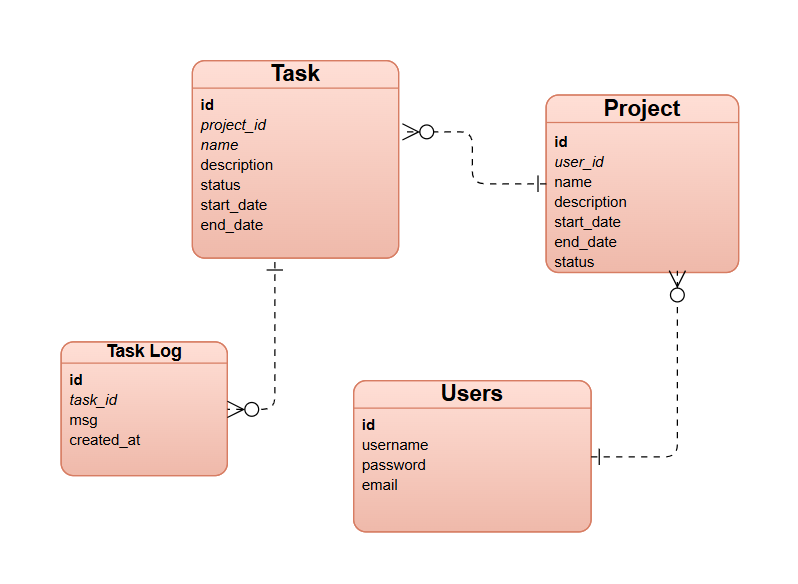

<h1>💻 Backend Repository Overview</h1>

<h2>🔹 Backend Repository (Current)</h2>

<strong>Description:</strong> This repository contains the Django REST API backend for the project. It manages Projects, Tasks, and Task Logs with full CRUD operations and role-based authentication using JWT.

<h3>🧩 Main Features</h3>
<ul>
  <li>✅ User authentication and registration (JWT-based)</li>

  <li>✅ Full CRUD for Projects, Tasks.</li>
  <li>✅ Task assignment and tracking</li>
  <li>✅ Associate tasks to projects and logs to tasks</li>
  <li>✅ API endpoints ready for integration with frontend SPA</li>
</ul>

<h2>⚙️ Installation / Setup</h2>
<ol>
  <li>Clone the repository: <code>git clone https://github.com/fatimahbali/Capstone-backend.git</code></li>
  <li>Create a virtual environment: <code>python -m venv venv</code></li>
  <li>Activate the environment: <code>source venv/bin/activate</code> (Linux/macOS) or <code>venv\Scripts\activate</code> (Windows)</li>
  <li>Install dependencies: <code>pip install -r requirements.txt</code></li>
  <li>Run Migrations: 
  <code>python manage.py makemigrations</code>
  <code>python manage.py migrate</code></li>
  <li>Start server: <code>python manage.py runserver</code></li>
</ol>
<h2>⚙️ Backend Routes - Server (Django REST API)</h2>

<h2>👥Users</h2>
<table border="1">
  <tr>
    <th>HTTP Verb</th><th>Path</th><th>Action</th><th>Description</th>
  </tr>
  <tr>
  <tr>
    <td>GET</td><td>/users/:id/</td><td>show</td><td>Show user details</td>
  </tr>
    <td>POST</td><td>/users/signup/</td><td>create</td><td>Register a new user</td>
  </tr>
  <tr>
    <td>POST</td><td>/users/login/</td><td>login</td><td>Login user</td>
  </tr>
  <tr>
    <td>POST</td><td>/users/logout/</td><td>delete</td><td>Logout user</td>
  </tr>
  <tr>
    <td>PUT</td><td>/users/:id/</td><td>update</td><td>Update user information</td>
  </tr>
  <tr>
    <td>DELETE</td><td>/users/:id/</td><td>destroy</td><td>Delete user</td>
  </tr>
</table>

<h2>🗂Projects</h2>
<table border="1">
  <tr>
    <th>HTTP Verb</th><th>Path</th><th>Action</th><th>Description</th>
  </tr>
  <tr>
    <td>GET</td><td>/projects/</td><td>index</td><td>List all projects for logged-in user</td>
  </tr>
  <tr>
    <td>POST</td><td>/projects/</td><td>create</td><td>Create a new project</td>
  </tr>
  <tr>
    <td>GET</td><td>/projects/:id/</td><td>show</td><td>Show project details</td>
  </tr>
  <tr>
    <td>PUT/PATCH</td><td>/projects/:id/</td><td>update</td><td>Update project</td>
  </tr>
  <tr>
    <td>DELETE</td><td>/projects/:id/</td><td>destroy</td><td>Delete project</td>
  </tr>
</table>

<h2>🧩Tasks</h2>
<table border="1">
  <tr>
    <th>HTTP Verb</th><th>Path</th><th>Action</th><th>Description</th>
  </tr>
  <tr>
    <td>GET</td><td>/projects/:project_id/tasks/</td><td>index</td><td>List all tasks in a specific project</td>
  </tr>
  <tr>
    <td>POST</td><td>/projects/:project_id/tasks/</td><td>create</td><td>Create a new task for a project</td>
  </tr>
  <tr>
    <td>GET</td><td>/tasks/:id/</td><td>show</td><td>Show task details</td>
  </tr>
  <tr>
    <td>PUT/PATCH</td><td>/tasks/:id/</td><td>update</td><td>Update task details</td>
  </tr>
  <tr>
    <td>DELETE</td><td>/tasks/:id/</td><td>destroy</td><td>Delete task</td>
  </tr>
</table>

<h2>🕒Task Log</h2>
<table border="1">
  <tr>
    <th>HTTP Verb</th><th>Path</th><th>Action</th><th>Description</th>
  </tr>
  <tr>
    <td>GET</td><td>/tasks/:task_id/logs/</td><td>index</td><td>Show all logs for a task</td>
  </tr>
  <tr>
    <td>POST</td><td>/tasks/:task_id/logs/</td><td>create</td><td>Create a new log for a task</td>
  </tr>
  <tr>
    <td>GET</td><td>/tasklogs/:id/</td><td>show</td><td>Show a specific log entry</td>
  </tr>
</table>
<h3>🧩 Associate Task to Project</h3>
<table border="1">
  <tr>
    <th>HTTP Verb</th><th>Path</th><th>Action</th><th>Description</th>
  </tr>
  <tr>
    <td>POST</td><td>/projects/:project_id/tasks/</td><td>create</td><td>Create a new task associated with a specific project</td>
  </tr>
  <tr>
    <td>GET</td><td>/projects/:project_id/tasks/</td><td>index</td><td>List all tasks under a specific project</td>
  </tr>
</table>

<h3>🕒 Associate Task to Task Log</h3>
<table border="1">
  <tr>
    <th>HTTP Verb</th><th>Path</th><th>Action</th><th>Description</th>
  </tr>
  <tr>
    <td>POST</td><td>/tasks/:task_id/logs/</td><td>create</td><td>Create a new log entry associated with a specific task</td>
  </tr>
  <tr>
    <td>GET</td><td>/tasks/:task_id/logs/</td><td>index</td><td>List all log entries for a specific task</td>
  </tr>
</table>

 

<h2>🧩 IceBox Features (Future Enhancements)</h2>
<ul>
  <li>📊 Dashboard with project and task analytics</li>
  <li>🔔 Real-time notifications for updates and new tasks</li>
  <li>📱 Mobile-friendly interface and potential mobile app</li>
  <li>🔍 Advanced filtering and search (by status, due date, assignee)</li>
  <li>🎯 Task priority and tagging system</li>
</ul>

<h3>ERD Diagram</h3>

  

<b>Backend Link:</b>  
<a href="http://127.0.0.1:8000/">http://127.0.0.1:8000/</a>
