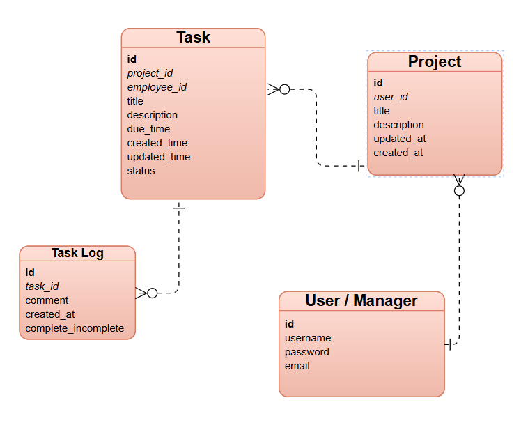

 <h2>Backend Routes - Server</h2>

<h2>Users / Managers</h2> <table border="1"> <tr>
<th>HTTP Verb</th><th>Path</th><th>Action</th><th>Description</th></tr> <tr><td>GET</td><td>/users</td><td>index</td><td>List all users or managers</td></tr> <tr><td>POST</td><td>/users</td><td>create</td><td>Create a new user or manager</td></tr> <tr><td>GET</td><td>/users/:id</td><td>show</td><td>Show details of a user or manager</td></tr> <tr><td>PUT/PATCH</td><td>/users/:id</td><td>update</td><td>Update user or manager details</td></tr> <tr><td>DELETE</td><td>/users/:id</td><td>destroy</td><td>Delete a user or manager</td></tr> </table>

<h2>Projects</h2> <table border="1"> <tr><th>HTTP Verb</th><th>Path</th><th>Action</th><th>Description</th></tr> <tr><td>GET</td><td>/projects</td><td>index</td><td>List all projects</td></tr> <tr><td>POST</td><td>/projects</td><td>create</td><td>Create a new project</td></tr> <tr><td>GET</td><td>/projects/:id</td><td>show</td><td>Show details of a project</td></tr> <tr><td>PUT/PATCH</td><td>/projects/:id</td><td>update</td><td>Update project information</td></tr> <tr><td>DELETE</td><td>/projects/:id</td><td>destroy</td><td>Delete a project</td></tr> </table>

<h2>Tasks</h2> <table border="1"> <tr><th>HTTP Verb</th><th>Path</th><th>Action</th><th>Description</th></tr> <tr><td>GET</td><td>/tasks</td><td>index</td><td>List all tasks</td></tr> <tr><td>POST</td><td>/tasks</td><td>create</td><td>Create a new task</td></tr> <tr><td>GET</td><td>/tasks/:id</td><td>show</td><td>Show details of a task</td></tr> <tr><td>PUT/PATCH</td><td>/tasks/:id</td><td>update</td><td>Update a task’s details</td></tr> <tr><td>DELETE</td><td>/tasks/:id</td><td>destroy</td><td>Delete a task</td></tr> </table>

<h2>Task Log</h2>
<table border="1">
  <tr><th>HTTP Verb</th><th>Path</th><th>Action</th><th>Description</th></tr>

<tr><td>GET</td><td>/tasklogs/:id</td><td>show</td><td>Show task log details</td></tr>
<tr><td>PUT/PATCH</td><td>/tasklogs/:id</td><td>update</td><td>Update a task log (mark complete/incomplete)</td></tr>
</table>

<h2>Associate Task to Project</h2> <table border="1"> <tr><th>HTTP Verb</th><th>Path</th><th>Action</th><th>Description</th></tr> <tr><td>POST</td><td>/projects/:project_id/tasks</td><td>create</td><td>Create a new task for a specific project.</td></tr> </table>

<h2>Associate Task to Task Log</h2> <table border="1"> <tr><th>HTTP Verb</th><th>Path</th><th>Action</th><th>Description</th></tr> <tr><td>POST</td><td>/task/:task_id/tasklog</td><td>create</td><td>Create a new task log for a specific task.</td></tr> </table>

